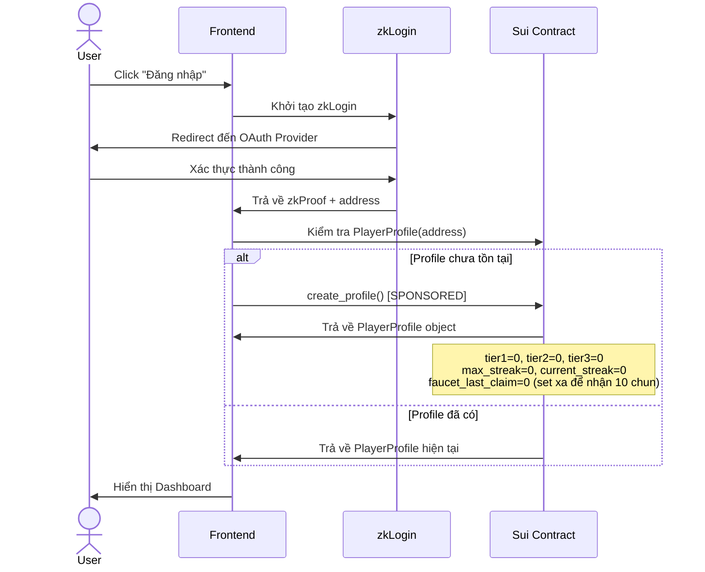
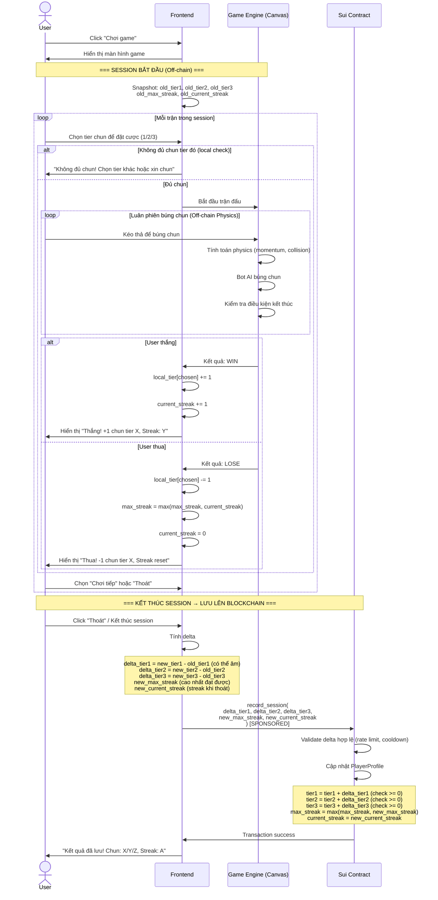
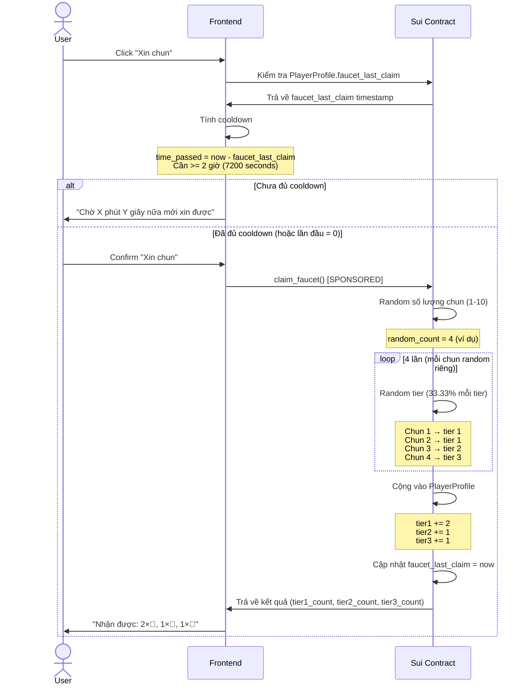
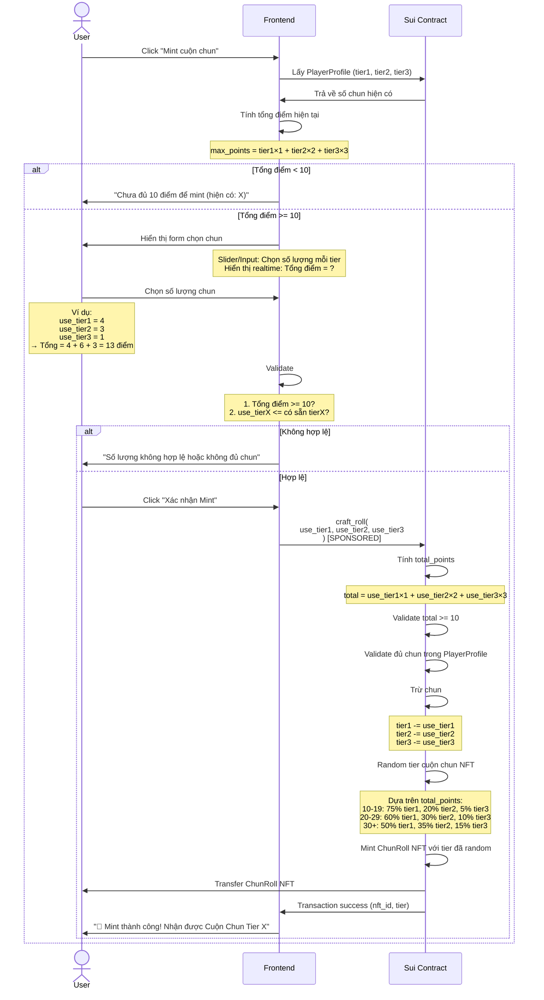
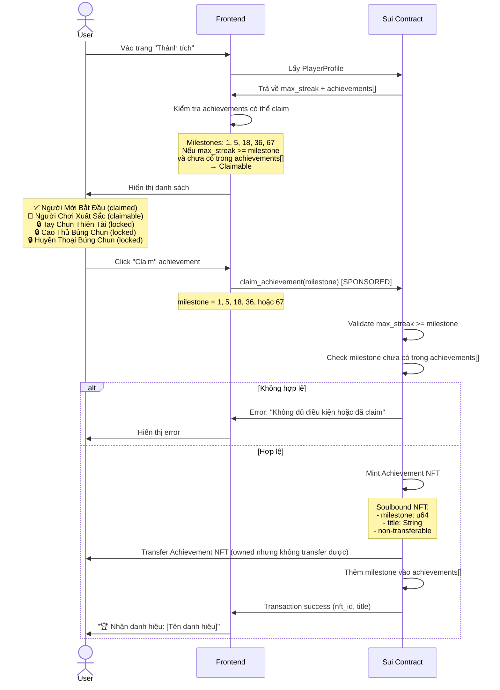
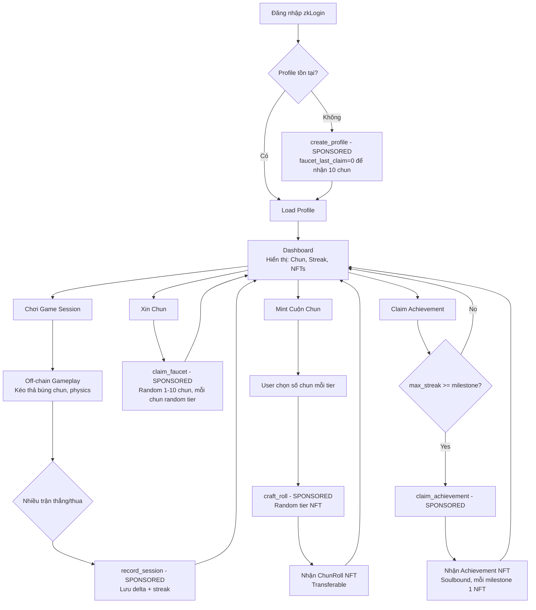
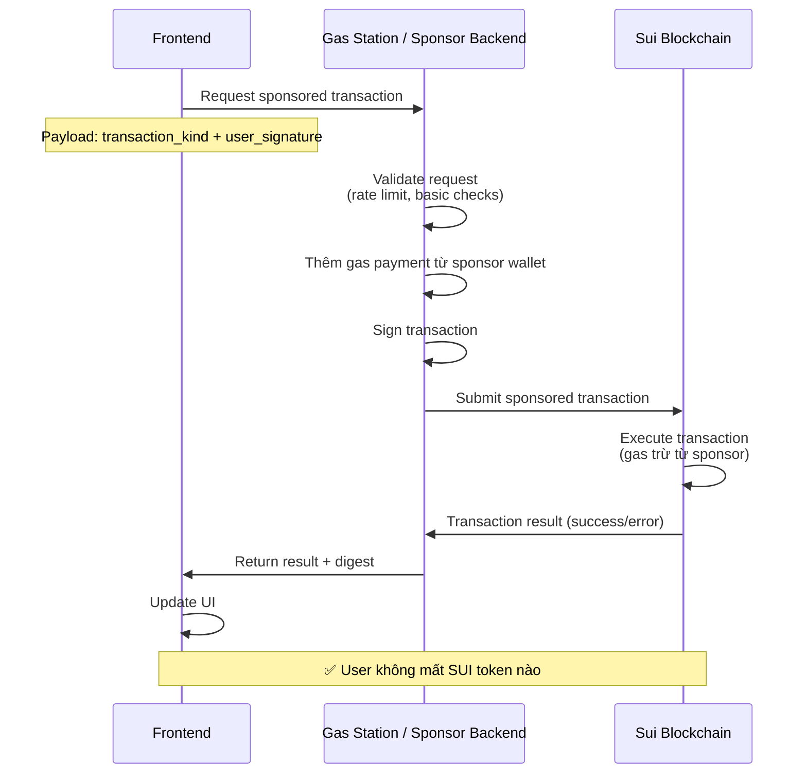

# Sequence Diagrams - SuiChin

## 🔐 1. Đăng nhập & Tạo Profile



---

## 🎮 2. Game Session (Off-chain Gameplay → On-chain Save)



---

## 🎁 3. Xin Chun (Faucet)



---

## 🎨 4. Mint Cuộn Chun NFT



---

## 🏆 5. Claim Achievement NFT (Soulbound)



---

## 📊 Luồng tổng quan



---

## 🔄 Sponsored Transactions Flow

Tất cả transactions đều được sponsor (hackathon scope):



---

## 🎯 Contract Data Structures & Functions

### PlayerProfile Object

```move
struct PlayerProfile has key, store {
    id: UID,
    owner: address,
    tier1: u64,              // Số chun đồng 🥉
    tier2: u64,              // Số chun bạc 🥈
    tier3: u64,              // Số chun vàng 🥇
    max_streak: u64,         // Streak cao nhất từng đạt (dùng unlock achievement)
    current_streak: u64,     // Streak hiện tại (reset về 0 khi thua)
    faucet_last_claim: u64,  // Timestamp (ms) lần xin chun cuối
    achievements: vector<u64> // Các milestone đã claim [1, 5, 18, 36, 67]
}
```

### ChunRoll NFT (Transferable)

```move
struct ChunRoll has key, store {
    id: UID,
    tier: u8,           // 1, 2, hoặc 3
    image_url: String,  // URL ảnh cuộn chun
}
```

### Achievement NFT (Soulbound)

```move
struct Achievement has key {  // Không có 'store' → non-transferable
    id: UID,
    milestone: u64,   // 1, 5, 18, 36, 67
    title: String,    // "Người Mới Bắt Đầu", "Cao Thủ Búng Chun"...
    owner: address,
}
```

### Public Functions

```move
// 1. Tạo profile mới (sponsored)
public entry fun create_profile(ctx: &mut TxContext)

// 2. Lưu kết quả session (sponsored)
public entry fun record_session(
    profile: &mut PlayerProfile,
    delta_tier1: i64,      // Âm nếu thua nhiều hơn thắng
    delta_tier2: i64,
    delta_tier3: i64,
    new_max_streak: u64,   // Streak cao nhất đạt được trong session
    new_current_streak: u64, // Streak hiện tại khi thoát
    ctx: &mut TxContext
)

// 3. Xin chun (sponsored)
public entry fun claim_faucet(
    profile: &mut PlayerProfile,
    clock: &Clock,
    ctx: &mut TxContext
)

// 4. Mint cuộn chun NFT (sponsored)
public entry fun craft_roll(
    profile: &mut PlayerProfile,
    use_tier1: u64,
    use_tier2: u64,
    use_tier3: u64,
    ctx: &mut TxContext
): ChunRoll

// 5. Claim achievement NFT (sponsored)
public entry fun claim_achievement(
    profile: &mut PlayerProfile,
    milestone: u64,  // 1, 5, 18, 36, hoặc 67
    ctx: &mut TxContext
): Achievement
```

---

## 🔒 Anti-cheat Validations (Hackathon Scope)

### record_session() validations:

- **Rate limiting**: Max 50 điểm tổng thay đổi mỗi session
- **Cooldown**: Tối thiểu 3 giây giữa các lần record
- **Non-negative check**: `tier + delta >= 0` cho mỗi tier
- **Streak hợp lý**: `new_current_streak <= new_max_streak`

### claim_faucet() validations:

- **Cooldown**: `now - faucet_last_claim >= 2 giờ (7200000 ms)`
- **Random fair**: Sử dụng `tx_context::epoch()` + `object::id()` để seed

### craft_roll() validations:

- **Minimum points**: `use_tier1 + use_tier2×2 + use_tier3×3 >= 10`
- **Sufficient balance**: `profile.tierX >= use_tierX`

### claim_achievement() validations:

- **Streak requirement**: `profile.max_streak >= milestone`
- **Not claimed**: `!vector::contains(&profile.achievements, milestone)`
- **Valid milestone**: `milestone ∈ {1, 5, 18, 36, 67}`
